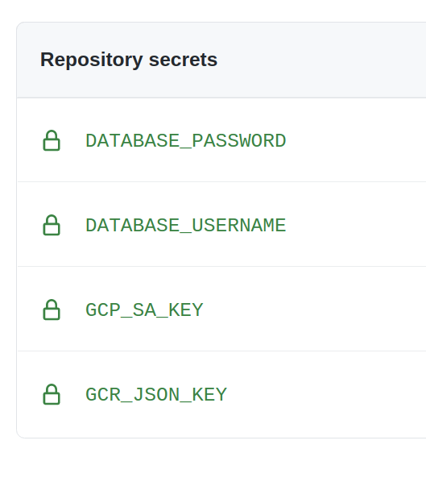
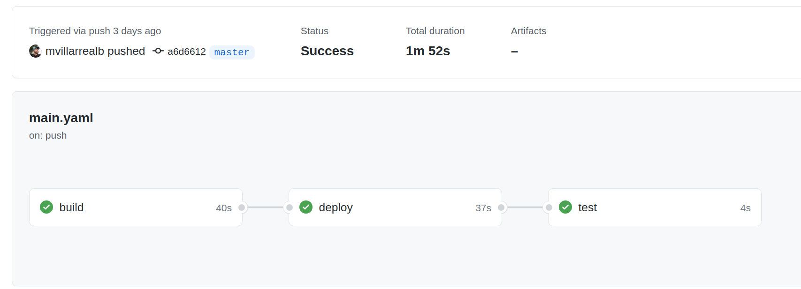

# Deploy a Serverless Api on Cloud Run with Github Actions

Google cloud Run is a serverless runtime designed for contanerized applications, it allows to run high availability applications with few configurations.

In this post we will deploy a Go Rest Api on Cloud Run using Github Actions as our CI/CD Tool.

# Requirements

* Google cloud cli
* Terraform - I am using v1.0.0
* Docker - I am using 20.10.7
* Go - I am using go1.16.4
* [This Repo :)](https://github.com/mvillarrealb/poi-api)

---

# Configuring Google Cloud Project

We need the following steps to setup a GCP project with cloud Run enabled and cloud SQL database instance prepared.

```sh
PROJECT_NAME="mvillarreal-demo-platform"
# Create GCP project(You must enable a billing account in your project)
gcloud projects create $PROJECT_NAME

# Set project as current running project
gcloud config set project $PROJECT_NAME

# View the current project
gcloud config get-value project

# Enable cloud Run api
gcloud services enable run.googleapis.com

# Enable resource manager api
gcloud services enable cloudresourcemanager.googleapis.com

# Enable vpc access api
gcloud services enable vpcaccess.googleapis.com

# Enable compute engine(for serverless vpc access)
gcloud services enable compute.googleapis.com

# Enable container Registry
gcloud services enable containerregistry.googleapis.com

# Enable Cloud SQL services
gcloud services enable sqladmin.googleapis.com

# Enable networking services
gcloud services enable servicenetworking.googleapis.com

# Service account for Github actions
gcloud iam service-accounts create mvillarrealb-gha-saccount \
--description "Main service account for github actions" \
--display-name "mvillarreal-gha-saccount"


# Assign editor role for service account(for terraform)
gcloud projects add-iam-policy-binding $PROJECT_NAME \
--member serviceAccount:mvillarrealb-gha-saccount@$PROJECT_NAME.iam.gserviceaccount.com \
--role roles/editor 

# Adding networking admin permission
gcloud projects add-iam-policy-binding $PROJECT_NAME \
--member serviceAccount:mvillarrealb-gha-saccount@$PROJECT_NAME.iam.gserviceaccount.com \
--role roles/servicenetworking.networksAdmin

# Export service account key for terraform(keep this in a safe place)
gcloud iam service-accounts keys create $(pwd)/terraform/service-account-key.json \
--iam-account mvillarrealb-gha-saccount@$PROJECT_NAME.iam.gserviceaccount.com

```

# Setup Terraform

Our Cloud Run service uses a **database** and is deployed inside a **private network**, in order to create these additional resources we will use Terraform, to do so execute the following commands:

```sh
# Initialize terraform dependencies
cd terraform && terraform init

# Preview terraform plan
terraform plan

# Apply Terraform(it will take about 10 minutes, cloud sql instance take some time)
terraform apply
```

# Post Terraform Tasks

After the installation some additional steps are required:

* Create database **poi_manager** in your cloud SQL instance, you can do it directly on Google Cloud Console or via Cloud SQL proxy.

* Generate a new password for the postgres User and copy it into some safe place(we will need it later)

---

# Prepare Dockerfile

To create a containerized version of our api, we will use docker multi stage build and take advantage of Go static compilation and create a lightweight image.

```dockerfile

#Build step
FROM golang:1.15 as builder
RUN mkdir -p /poi-api/api
WORKDIR /poi-api
ADD api ./api
COPY go.mod go.sum main.go ./
#static compilation options for go
RUN go build -ldflags "-linkmode external -extldflags -static" -o main .

#Run step
#Scratch image is an empty image to add our binary, so the image will be as small as possible
FROM scratch
#Environments for dataase connection
ENV DATABASE_HOST="127.0.0.1" \
DATABASE_PORT="5432" \
DATABASE_USERNAME="postgres" \
DATABASE_PASSWORD="password"
#Copy binary from builder
COPY --from=builder /poi-api/main ./main
CMD ["./main"]
```

---
 
# Cloud Run Deploy with Github Actions

Finally to deploy the api in cloud run we will create a pipeline using Github actions, our pipeline structure is as follows:

```yaml
name: poi-api
on:
  push:
    branches:
    - master
env:
  REGION: us-east1 # Cloud Run zone
  PROJECT_ID: mvillarreal-demo-platform # GCP project
  BASE_IMAGE: gcr.io/mvillarreal-demo-platform/poi-api #Container registry entry for the api
  DATABASE_INSTANCE: mvillarreal-pg-sql # Cloud sql instance name
  SERVICE_NAME: poi-api #Cloud run service name
  DATABASE_IP: 10.85.0.3 # My database private IP address
jobs:
  build: # Definition for Build Job
  deploy: # Definition for deploy Job
  test: # Definition for Test Job

```

Now we must define each job:

## Build Job

In the build stage we will use our dockerfile to build and push to gcr the created image

```yaml
    runs-on: ubuntu-latest
    steps:
      - name: Setup Project # Setup
        id: checkout
        uses: actions/checkout@master
      - name: Login to GCR # Login to GCP
        uses: docker/login-action@v1
        with:
          registry: gcr.io
          username: _json_key
          password: ${{ secrets.GCR_JSON_KEY }}
      - name: Build & Publish Image # Use the dockerfile to publish image
        uses: docker/build-push-action@v2
        id: build
        with:
          context: .
          push: true
          tags: ${{ env.BASE_IMAGE }}:${{ github.sha }}
```

## Deploy Job

The deploy stage will use the deploy-cloudrun action to create a successful cloud run api

```yaml
    runs-on: ubuntu-latest
    needs: [build]
    steps:
      - name: Deploy to Cloud Run
        id: deploy
        uses: google-github-actions/deploy-cloudrun@main
        with:
          region: ${{ env.REGION }}
          service: ${{ env.SERVICE_NAME }}
          image: ${{ env.BASE_IMAGE }}:${{ github.sha }}
          credentials: ${{ secrets.GCP_SA_KEY }}
          env_vars: "DATABASE_HOST=${{ env.DATABASE_IP }},DATABASE_USERNAME=${{ secrets.DATABASE_USERNAME }},DATABASE_PASSWORD=${{ secrets.DATABASE_PASSWORD }}"
          flags: "--allow-unauthenticated --vpc-connector vpc-conn --add-cloudsql-instances '${{ env.PROJECT_ID }}:${{env.REGION}}:${{env.DATABASE_INSTANCE}}'"
```
Let's take a closer look on some settings we've added in here:

### env_vars 

Environment variables set on cloud run application in the format env=value,env2=value2, the variables assigned were:

Variable|Description
---|---
DATABASE_HOST|Database Host, in this case the private ip specified in the env section
DATABASE_USERNAME|Database Username loaded in the secrets of our repo
DATABASE_PASSWORD|Database Password loaded in the secrets of our repo


### flags

Cloud run specific settings used to configure the api:

Setting|Description
---|---
--allow-unauthenticated|Allow requests from unauthenticated users
--vpc-connector vpc-conn| Specifiy a serverless vpc connector **vpc-conn** was the connector we created on the terraform file
--add-cloudsql-instances 'env.PROJECT_ID:env.REGION:env.DATABASE_INSTANCE'|Links the cloud sql instance to the api to be able to use it

## Test Job

Last but not least we will run a postman collection to test our deployed service

```yaml
    runs-on: ubuntu-latest
    needs: [build, deploy]
    steps:
      - name: Generate Variable File
        run: |
          echo {\"BASE_URL\": \"{{ needs.deploy.outputs.url }}\"} > variables.json
      - name: Run e2e Test
        uses: matt-ball/newman-action@master
        id: test
        with:
          collection: poi-e2e.postman_collection.json
          environment: variables.json
```

Before pushing your changes, we must configure some secrets under the Settings > Secrets in our repository:



The secrets we've added are the following:

Secret|Description
---|---
DATABASE_USERNAME|Cloud SQL database username
DATABASE_PASSWORD|Cloud SQL database password(we adquired this in previous steps)
GCP_SA_KEY|Base 64 encoded service account key
GCR_JSON_KEY| Json format service account key


After a push into the master branch a job will be triggered deploying our service to cloud run:



# Post Installation Steps

If you want to use the geocoding endpoint and reference the points of interest you can load the sql file in GCP:

```sh
# Create a bucket to load initial data
gsutil mb gs://h3-indexes

# Upload files
gsutil cp $(pwd)/data/*.sql gs://h3-indexes

# Load data(Remember to add ACL permissions to the h3-indexes directory)
gcloud sql instances import mvillarreal-pg-sql gs://h3-indexes/PE-Lima.sql \
--database poi_manager
```

# What Have We done so far?

* Setup a Google Cloud project

* Provision basic services with Terraform

* Dockerize a Go Rest Api using multi stage builds

* Use Github Actions to enable a CI/CD pipeline

# What's Left to do?

* Add a custom Domain for your Cloud Run api

* Disable public access for your api

* Add some unit test on the codebase

# Conclussions

* Cloud Run can be a good option if you are starting a serverless based architecture, or can be an  intermediary step if you are thinking on kubernetes on a long term(booth solutions are container based).

* Github actions is a robust CI/CD tool with strong community based actions

* Using golang you can reduce the footprint of your end product using static compilation :)